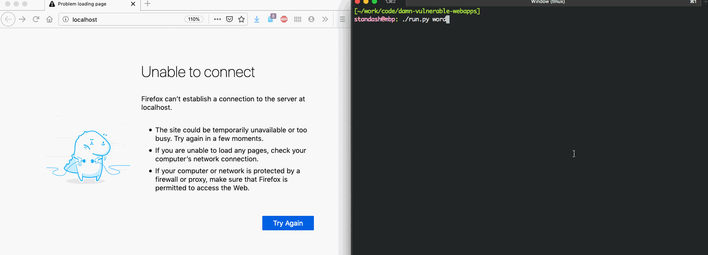

# damn-vulnerable-web-apps

This project is a collection of vulnerable web apps, and a tiny framework that allows to quickly deploy them 
using Docker. I have either developed a few of these apps to demonstrate basic concepts (e.g., sql/nosql injections),
or borrowed them elsewhere (e.g., the OWASP's NodeGoat project and Wordpress 3.2).

These vulnerable apps should be used for learning basic concepts of web security. Feel free to clone this project 
and/or add your own apps of interest.

The structure of the project is as follows:
  - The "apps" folder contains a collection of vulnerable apps, where each 
    individual app folder contains the zipped sources of an app, as well
    the Docker files that are needed to deploy it.
  
  - The "run.py" file serves as the main entry point for deploying the apps
    (e.g., you only need to run this script and specify the app of interest,
    and internal/external Docker ports, see some examples below).
    
    
### Installation 

You don't need to install anything apart from Python 3.7.x and Docker 19.03.x (I used with these versions on my machine, but 
older versions should work fine as well). For Docker with Linux, make sure that your user accound is a member of the
"docker" group, otherwise just execute the "run.py" script with 'sudo'.

When you deploy an app for the first time, it may take a while for Docker to build a corresponding image.
(however, this will be done only once for each app).

### Apps that are currently available

- OWASP NodeGoat https://www.owasp.org/index.php/Projects/OWASP_Node_js_Goat_Project

- WordPress 3.2 
  -- a very old version of Wordpress that has been released back in 2011 and should contain plenty of vulnerabilities.
  
- Honeypot
  -- a simple Node.js app that saves to a MongoDB database parts of the user query (can be used to demonstrate CSRF 
  and XSS attacks).
 
- Nosqlinjection
  -- a simple Node.js app that has a NoSQL injection flaw.
  
- Sqlinjection
  -- a simple Node.js app that has a SQL injection flaw.
  
- Xssreflected
  -- a simple Node.js app for demonstrating how reflected XSS attacks work (can be used in conjunction with Honeypot).

### Examples

```
./run.py nodegoat 8888 88
```

The above command will deploy the NodeGoat app with Docker. To start playing with the app, open your web 
browser and navigate to "http://localhost"



### Adding more apps

- Take the sources/executables of a vulnerable app and compress them into a .zip archive.
- Create a set of Docker files for deploying the app
- Place everything into the "apps/<application_name>" folder
- Run as "./run.py <application_name> <guest_port> <host_port>"
- Access via "localhost:<host_port>" using a web browser
- (feel free to look at the sources to learn more how all this stuff works)
